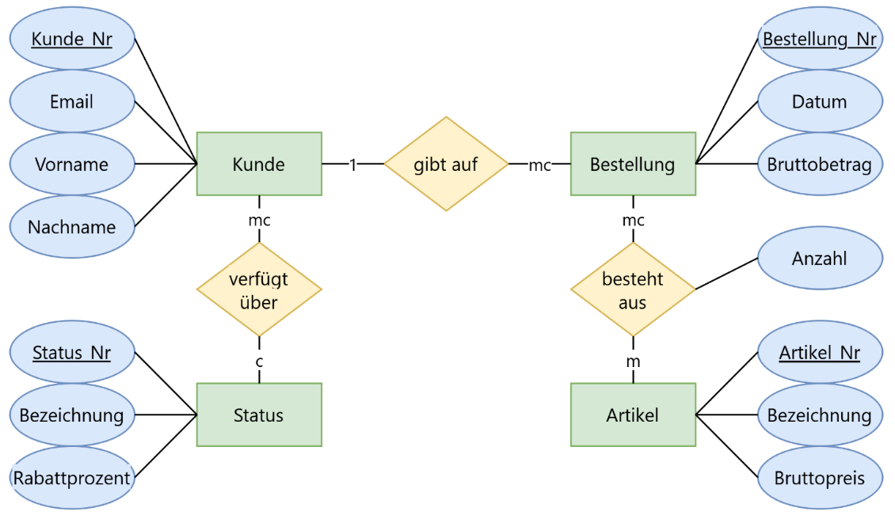

## ERM

## Lösung

Kunde (Kunden_Nr, Email, Vorname, Nachname, fk_Status_Nr)

Status (Status_Nr, Bezeichnung, Rabattprozent)

Bestellung (Bestellung_Nr, Datum, Bruttobetrag, fk_Kunde_Nr)

besteht_aus(fk_Bestellung_Nr, Artikel_Nr, Anzahl)

Artikel (Artikel_Nr, Bezeichnung, Bruttopreis)