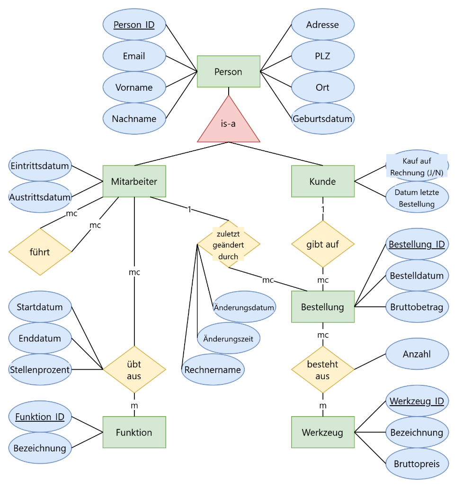

## ERM

## Lösung

Person (Person_ID, Email, Vorname, Nachname, Adresse, PLZ, Ort, Geburtstag)

Mitarbeiter (fk_Person_ID, Eintrittsdatum, Auftrittsdatum)

führt (fk_Person_ID_Vorgesetzter, fk_Person_ID_Untergebener)

übt_aus (fk_Person_ID, fk_Funktion_ID, Startdatum, Enddatum, Stellenprozent)

Funktion (Funktion_ID, Bezeichnung)

 

zuletzt_geändert_durch (fk_Bestellung_ID, fk_Person_ID, Äanderungsdatum, Änderungszeit, Rechnername) 

 

Kunde (fk_Person_ID, Kauf auf Rechung j/n, Datum letzte Bestellung)

Bestellung (Bestellung_ID, Bestelldatum, Bruttobetrag)

besteht_aus (fk_Bestellung_ID, fk_Werkzeug_ID, Anzahl)

Werkzeug (Werkzeug_ID, Bezeichnung, Bruttopreis)