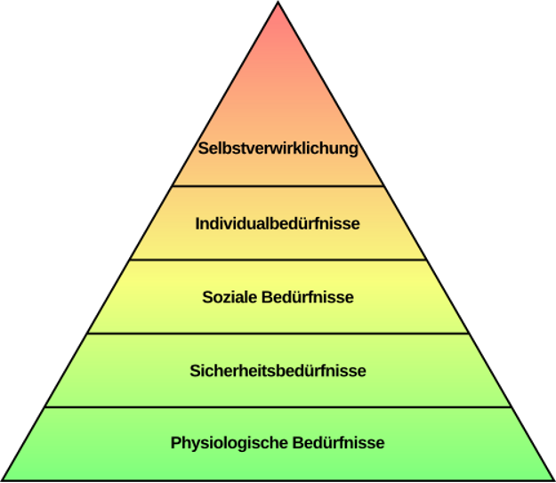
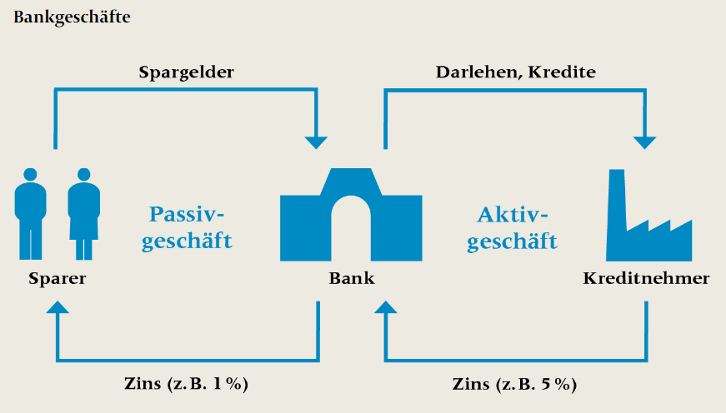
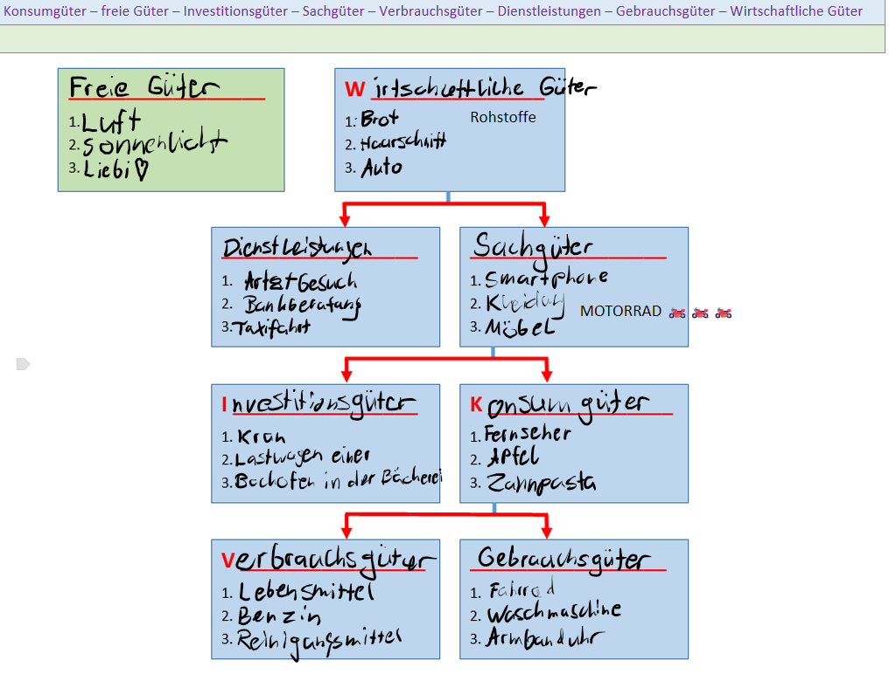

# Zusammenfassung ABU: 02. Geld und Unternehmen

## 1. Bedürfnisse, Nachfrage und Angebot
Die Wirtschaft entsteht aus dem Verlangen der Menschen, Mängel zu beheben – das nennt man **Bedürfnisse**.

**Die Bedürfnispyramide nach Maslow**:
1. **Lebenswichtiges:** Nahrung, Schlaf, Kleidung, Wohnung.
2. **Sicherheit:** Schutz, sicherer Arbeitsplatz, Versicherungen, Gesetze.
3. **Dazugehörigkeit:** Liebe, Freunde, Kommunikation.
4. **Anerkennung:** Status, Wohlstand, Karriere, Respekt.
5. **Selbstverwirklichung:** Unabhängigkeit, Entfaltung der eigenen Persönlichkeit.

**Wichtige Begriffs-Unterscheidungen**:
* **Existenz- vs. Wahlbedürfnisse:** Existenzbedürfnisse sind lebensnotwendig (Essen). Wahlbedürfnisse kommen danach (Ferien, Auto).
* **Individual- vs. Kollektivbedürfnisse:** Individualbedürfnisse hat jeder für sich (ein eigenes Handy). Kollektivbedürfnisse entstehen, wenn viele das Gleiche wollen (Strassenbau, Spitäler).
* **Materiell vs. Immateriell:** Materielle Dinge kann man kaufen (Brot). Immaterielle nicht (Liebe, Gesundheit).

**Güterarten**:
* **Freie Güter:** Sind gratis und unbegrenzt (Luft, Sonne).
* **Wirtschaftliche Güter:** Sind begrenzt und kosten etwas.
    * **Sachgüter:** Greifbare Dinge (Auto).
    * **Dienstleistungen:** Arbeit von Menschen (Coiffeur, Arzt).
    * **Konsumgüter:** Für den privaten Gebrauch (Nahrung).
    * **Investitionsgüter:** Um damit zu arbeiten/produzieren (Baukran).

**Marktgesetze**:
* **Nachfragekurve:** Preis sinkt -> Nachfrage steigt.
* **Angebotskurve:** Preis steigt -> Angebot der Firmen steigt.

---

## 2. Geld und Geldinstitute

**Die 3 Funktionen von Geld**:
1. **Zahlungsmittel:** Zum Kaufen/Bezahlen.
2. **Wertaufbewahrungsmittel:** Zum Sparen.
3. **Wertmassstab:** Um Preise zu vergleichen.

**Geldinstitute**:
* **SNB (Nationalbank):** Steuert den Geldumlauf, druckt die Noten und sorgt für stabile Preise. Keine Bank für Privatkunden.
* **Geschäftsbanken:**
    * **Passivgeschäft:** Bank nimmt Spargeld an (zahlt tiefen Zins).
    * **Aktivgeschäft:** Bank gibt Kredite an Firmen (verlangt höheren Zins).
    * **Dienstleistung:** Geldwechsel, Karten, Zahlungsverkehr.

---

## 3. Lohn und Budget

**Lohnabrechnung**:
* **Bruttolohn:** Der Lohn gemäss Vertrag (vor Abzügen).
* **Nettolohn:** Das Geld, das aufs Konto kommt (nach Abzügen).

**Wichtigste Abzüge**:
* **AHV/IV/EO:** Alters-, Invaliden- und Erwerbsersatz.
* **ALV:** Arbeitslosenversicherung.
* **NBU:** Nichtberufsunfall-Versicherung.

**Budget**:
* **Fixkosten:** Bleiben immer gleich (Miete, Krankenkasse, Handy-Abo).
* **Variable Kosten:** Kann man beeinflussen (Essen, Ausgang, Hobby).
* **Rückstellungen:** Sparen für Fixkosten, die nicht monatlich kommen (Steuern, Zahnarzt).

---

## 4. Wirtschaftskreislauf und Sektoren

**Die 3 Wirtschaftssektoren**:
1. **Primärsektor:** Rohstoffgewinnung (Landwirtschaft, Bergbau).
2. **Sekundärsektor:** Verarbeitung (Industrie, Bau, Handwerk).
3. **Tertiärsektor:** Dienstleistungen (Banken, Tourismus, Verkauf).

**Wirtschaftskreislauf**:
* **Einfacher Kreislauf:** Zusammenspiel zwischen Haushalten (Arbeit/Konsum) und Unternehmen (Lohn/Waren).
* **Erweiterter Kreislauf:** Beinhaltet zusätzlich den Staat (Steuern/Aufträge), die Banken (Zinsen/Kredite) und das Ausland (Import/Export).

---

## 5. Wohlstand und Wohlfahrt

* **Wohlstand:** Materieller Reichtum (Besitz, Geld). Gemessen durch das **BIP**.
* **Wohlfahrt:** Lebensqualität (Gesundheit, Freiheit, Sicherheit, Umwelt).
* **BIP (Bruttoinlandprodukt):** Gesamtwert aller Güter und Dienste eines Landes pro Jahr.
    * *Reales BIP:* Um die Teuerung (Inflation) korrigiert – zeigt das echte Wachstum.
* **Lorenzkurve:** Grafik, die zeigt, wie gerecht oder ungerecht Einkommen und Vermögen verteilt sind.

---

## Schwierige Begriffe kurz erklärt
* **Inflation:** Das Geld verliert an Wert (Preise steigen).
* **Subventionen:** Finanzielle Unterstützung vom Staat an Unternehmen.
* **Kapital:** Geld oder Maschinen, die zur Produktion genutzt werden.
* **Kaufkraft:** Wie viel man sich für einen Franken tatsächlich kaufen kann.